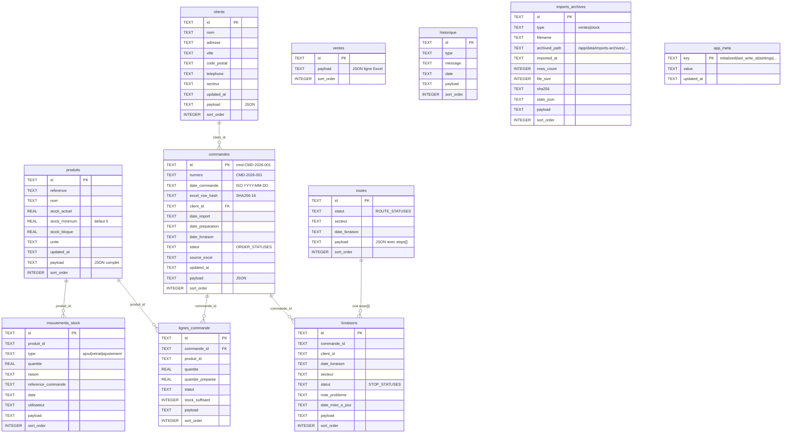

# Schéma SQLite Sereo (v1.13.2)

> Source unique : `storage/sqliteStore.js` (fonction `migrateSchema`).
> Ce document est un **guide visuel** pour comprendre les relations, pas une définition normative. Les types et contraintes officielles restent dans le code.

## Tables (10)



## Indexes

```sql
-- commandes
CREATE INDEX idx_commandes_numero ON commandes(numero);                       -- recherche par numéro humain
CREATE INDEX idx_commandes_client_date ON commandes(client_id, date_commande); -- match (clientId, date) à l'import
CREATE INDEX idx_commandes_hash ON commandes(excel_row_hash);                  -- détection re-import idempotent
CREATE INDEX idx_commandes_statut ON commandes(statut);                        -- filtre page Bons (v1.13.0+)
CREATE INDEX idx_commandes_date_livraison ON commandes(date_livraison);        -- filtre page Livraison (v1.13.0+)

-- imports_archives
CREATE INDEX idx_imports_archives_at ON imports_archives(imported_at DESC);
CREATE INDEX idx_imports_archives_type ON imports_archives(type, imported_at DESC);
```

## Notes

- **`payload` JSON** : chaque table principale stocke aussi le JSON complet de l'objet dans `payload` (TEXT). Permet de garder des champs custom hors schéma SQL sans migration. Le code parse/serialize via `JSON.parse/stringify`.
- **Pas de `FOREIGN KEY` strict** sur les relations clients↔commandes : préserver la souplesse en cas de purge sélective. Les jointures se font côté code.
- **Seuil stock minimum** : `produits.stock_minimum` vaut `5` par défaut pour préserver l'ancien comportement. Le payload produit expose aussi `alertThreshold` / `stockMinimum`; la logique métier recommande un produit quand `stock_actuel <= seuil minimum`.
- **Pas de soft-delete** : un `DELETE` est définitif. Pour préserver l'historique, utiliser `mouvements_stock` (stock) ou `historique` (général).
- **WAL mode** activé pour les écritures concurrentes (`PRAGMA journal_mode = WAL`).
- **Numérotation `commandes.numero`** : voir [ADR 0001](adr/0001-erp-bucketing-par-client-date.md).
